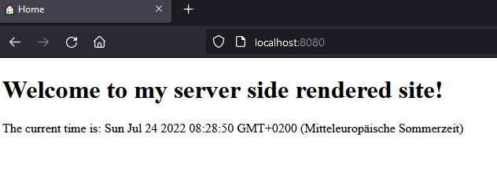

# ssr-framework

serve static files to your client using sever side rendering

## example

```js
const home = new UiCore(
    () => `
        <h1>Welcome to my server side rendered site!</h1>
        <p>The current time is: ${new Date()}</p>
    `,
    new PageConfig(undefined, "🏠 Home")
);

const server = new ServerCore();
server.registerRoute("/", home);
server.serve(8080);
```


